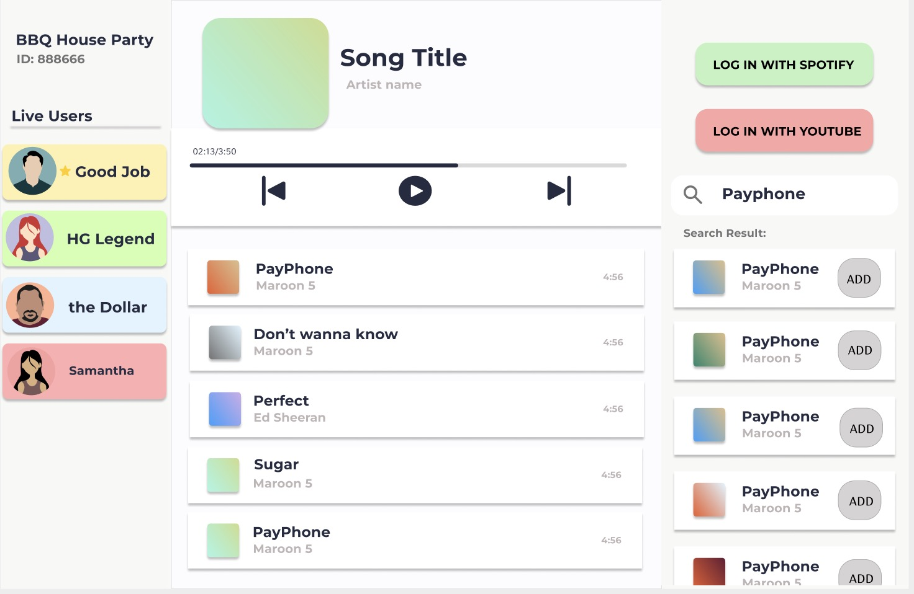

# Supreme Karaoke 

## Description 🎉

Ever host a house party or playing music in a fun car trip with some of your buddies? This web application transforms how music is managed at social gatherings. No more awkward moments of asking for the host's phone to play your favorite songs! With this app, everyone at the party can join a shared online room, connect their Spotify account, and contribute to the playlist in real-time. 

Mobile UI:


Design Documentation:
[Design Doc](./docs/design-doc.md)

## Table of Contents

- [Installation](#installation)
- [Usage](#usage)
- [Features](#features)
- [Contributing](#contributing)
- [License](#license)

## Installation🛠️
1. Clone the repo
```
git clone https://github.com/siwu-945/FunTrip.git
```

2. Install Dependencies for frontend
```shell
cd client
npm install
```
3. Install Dependencies for backend
```shell
cd ../server
npm install
```
4. Set up SSH key if you haven't done so. It will make your local deployment easier.
[SSH Doc](https://docs.github.com/en/authentication/connecting-to-github-with-ssh/adding-a-new-ssh-key-to-your-github-account)

Once set up, you can clone the repository using: git clone git@github.com:siwu-945/FunTrip.git

5. Set up .env files, make sure you are in the root dir, set up appropriate values accordingly 
```shell
cp docs/.env.frontendExample client/trip-frontend/.env
cp docs/.env.serverExample server/.env
```

You need to retrieve the Client ID and Client Secret from your Spotify Web API app.
Follow the [Spotify Documentation](https://developer.spotify.com/documentation/web-api/concepts/apps) to register your app and obtain the credentials.


6. Run the application with 2 terminals
```shell
cd server
npm run dev
```
```shell
cd client/trip-frontend
npm run dev
```

7. Then you should be able to access the application. Open up your browser and enter http://localhost:5173/

## Features🚀
- Collaborative Playlists: Create or join a room to collectively manage a Spotify playlist with your friends.
- Real-Time Updates: Powered by socket.io, playlist changes are instantly reflected for all participants.
- Real-Time Chats: Getting annoyed about the guy with the worst music taste but can't find them at the party? Talk to them!
- Spotify Integration: Authenticate with Spotify via OAuth 2.0 to securely manage and play songs from your account.
- Inclusive Experience: No more privacy concerns or awkward phone handoffs—everyone can contribute seamlessly.


## Contributing
- Whether you’re fixing bugs, adding features, or suggesting improvements, your help is appreciated. Please contact me before start working.
- This application is currently in progress, and I'm actively building features and refining workflows. Please read the Design Docs to understand the architecture and how the application functions. These documents provide a detailed roadmap and context for contributing effectively.

## TODO
#### Frontend:
1. Enhance the UI for the playlist and room management.
2. Add better error handling for Spotify API failures.
3. Optimize the user experience for mobile browsers.
Backend:

#### Server
1. APIs to send user message back and forth
2. Separate users into different room 

#### General
1. User login page
2. Possible database management service to store user song preference


