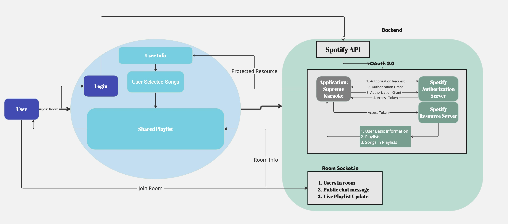

## Overview
- The Collaborative Party DJ Web App solves the problem of managing music playlists at social gatherings by allowing multiple users to join a shared room, connect their Spotify accounts, and collaboratively manage a playlist in real time. The app leverages React and TypeScript for the frontend, Express for the backend, and socket.io for real-time communication.

## System Architecture
1. Frontend:
   1. Built with React and TypeScript using Vite.
   2. Connects to the backend via RESTful APIs for data and uses socket.io for real-time updates.
2. Backend:
    1. Built with TypeScript and Express. 
    2. Provides endpoints for user authentication, playlist management, and room functionality.
3. Realtime communication:
   1. socket.io ensures instant updates to playlists across all connected users.
4. Spotify Integration and Why is User Data Safe

## API Design (TODO)
#### Authentication
#### Spotify Playlist Management
#### Room Management

## Challenges and Solutions (TODO)
1. Spotify Authentication 
2. Room integration with user retrieved information (cookie?)
3. Synchronization across clients

## Future Enhancements
1. Host can become the room master
2. Delete song choices
3. Store room specific playlist and next time user can login to listen to room playlist song

